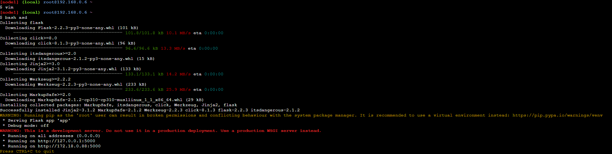

# LinuxHW1
Первое домашнее задание по "ПО облачных платформ"
## Cервер А

Для настройки сервера А необходимо исполнить [serverA.sh](serverA.sh).
После чего на нем автоматически запустится веб сервер 

После получения с серврера C запроса увидим следующую строчку 

## Cервер B
В результате исполнения баш скрипта [serverB.sh](serverB.sh) на сервере появляются два новых порта

## Cервер C
После исполнения баш скрипта можно удостоврериться что сервер С связан с сервером А 

Что бы проверить работу шлюза, отправим запрос на веб приложение сервера А
